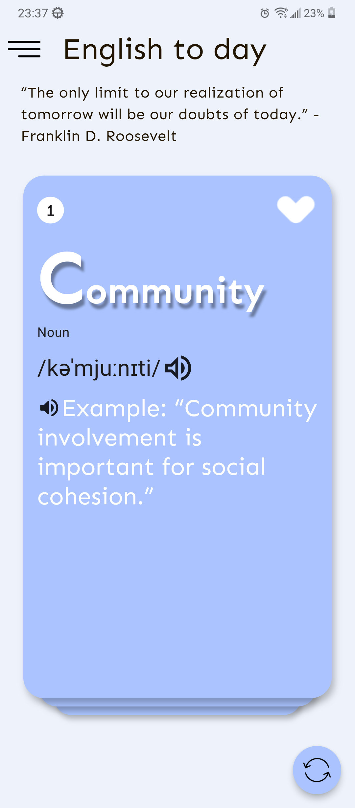

# English Card

## Project Description

English Card is an app that makes learning English more interesting

## Preview

<!-- [](https://www.youtube.com/watch?v=eFZRFAqbIUA) -->

<a href="link_to_video">
  
</a>

## Installation

### Step 1: Clone the Project

```bash
git clone https://github.com/vanh6803/EnglishApp
```

### Step 2: Install Dependencies

```bash
cd EnglishApp/backend
npm i
```

## Contribution

I welcome contributions and feedback from the community. If you have any ideas, please open an issue or submit a pull request.

## Contact

If you have any questions or suggestions, please contact me via email: anhnv6083@gmail.com.
